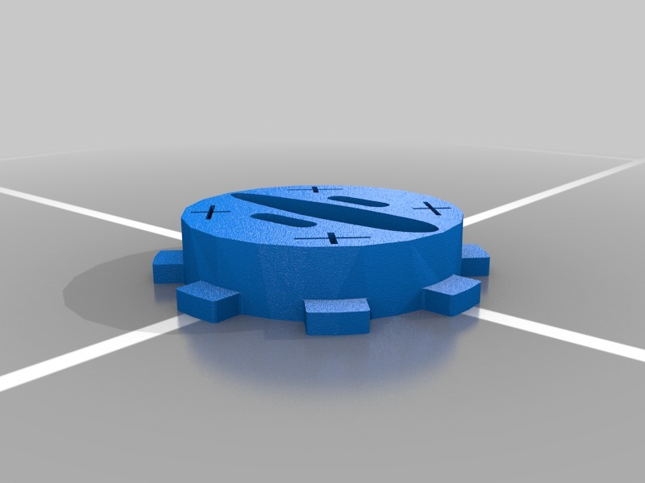

This is the basic lock adapter that ships with Lockitron. The part fits around your lock. Lockitron uses this part to rotate your door lock to a locked or unlocked position.

Feel free to modify to better fit your door!

All Rights Reserved. 2014 Apigy Inc.
